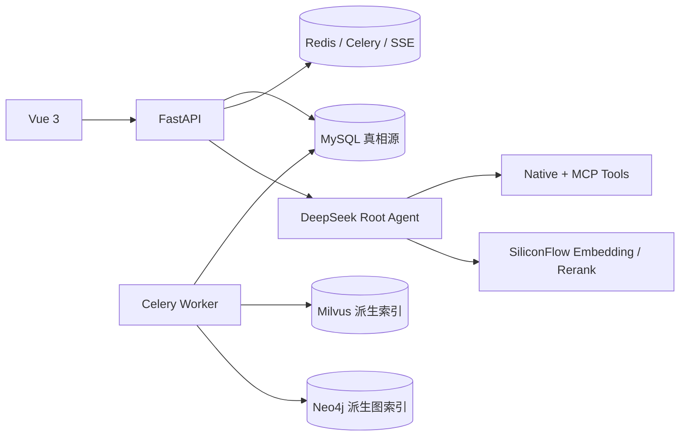

# NotebookAgent 第一版开发方案

> 版本口径：2026-09-22。本文只描述第一版运行路径；长期 Memory、Subagent、MoA、Agent CLI 明确延期。

## 1. 第一版交付边界

```text
Vue 3 + FastAPI
+ MySQL + Redis + Celery
+ Milvus Dense/BM25混合检索
+ Neo4j GraphRAG
+ DeepSeek Root Agent Loop
+ 论文全文Query与自动完整分窗
+ 6个业务工具
+ MCP Client与Server
+ 配置式Skills与动态Tool Search
+ 权限审批、Checkpoint、SSE、引用
+ Docker Compose
```

运行口径：第一版只保证Docker镜像链路，使用`.env`内的容器服务名与`/app/...`配置路径；不把宿主机直跑作为Definition of Done。

后续再做：跨会话长期Memory、Subagent Runtime、MoA Planner、Agent CLI。Conversation Summary只帮助当前会话延续，Checkpoint只帮助当前Run恢复，它们都不是长期Memory。

## 2. 总体架构与数据职责



| 系统 | 保存什么 | 定位 |
|---|---|---|
| MySQL | 用户、Notebook、文件版本、完整原文、Chunk、对话、Run、Evidence、Citation | 唯一真相源 |
| Milvus | 论文画像向量（`notebook_documents_v1`）与Chunk Dense/BM25索引（`document_chunks_v2`） | 可重建 |
| Neo4j | 文档、章节、Chunk、实体、方法、数据集、指标和有证据关系 | 可重建 |
| Redis | Celery队列、实时事件、缓存、取消信号 | 短期运行状态 |
| 文件存储 | 原始PDF/TXT/MD | 二进制不直接发给模型 |

## 3. 文档摄取与索引

```text
上传原文件
→ 创建Document / DocumentVersion / IngestionJob
→ Celery解析文本与页码
→ 保存full_text、Section与Chunk到MySQL
→ 抽取原始信息并生成结构化论文概要，写入document_profiles
→ SiliconFlow BGE-M3生成1024维Embedding
→ Milvus写入Chunk索引与论文画像索引
→ 抽取实体和有证据关系
→ Neo4j写入图索引
→ DocumentVersion变为ready
```

论文画像分三部分：原始信息（标题、作者、年份、关键词、完整摘要、研究地区/时间范围）、结构化概要（一句话概括、数据与方法、结果与结论、创新与不足；"对自己研究的参考价值"属于个人判断，不进入论文事实）、profile_text（标题+关键词+完整摘要+结构化概要，用于文档层检索）。摘要缺失时由LLM生成并标记`abstract_source=generated`。历史数据可用`scripts/reindex.py`从MySQL重灌Milvus。

图索引与主任务解耦：全文、Chunk、画像和Emb维写入Milvus后，`DocumentVersion`立即`ready`；随后由独立Celery任务`build_graph_index`构建Neo4j图，进度写入`DocumentVersion.graph_status`（`pending/building/ready/failed`）。图任务可失败、可重试，绝不影响文档`ready`。前端资料行显示「处理中 / 图谱构建中 / 可检索 / 图谱失败」，并在图完成/失败时弹出非阻塞提示。

Neo4j目标节点为`DocumentVersion / Section / Chunk / Entity / Method / Dataset / Metric / Paper`，目标关系为`HAS_SECTION / HAS_CHUNK / NEXT_CHUNK / MENTIONS / USES_METHOD / USES_DATASET / MEASURES_METRIC / CITES / COMPARES_WITH / SUPPORTS / CONTRADICTS / RELATED_TO`。

每条模型抽取关系必须保存`notebook_id、document_version_id、evidence_chunk_ids、confidence、extractor_model、extractor_version`。没有有效`evidence_chunk_ids`的关系只能导航，不能作为回答证据。

## 4. 当前Query与论文全文

逻辑输入使用`QueryEnvelope`：用户原始文字 + 附件名称/ID/类型 + 用户附件指令 + 每篇附件完整解析正文。

预算内：所有正文和原始Query放在同一个User Message，不先Top-K，不先摘要。

超出物理窗口：

```text
原始任务
→ 按附件、段落、页码连续分窗
→ 每个窗口重复原始任务
→ 所有字符范围至少处理一次
→ 保存窗口级结论与范围
→ Root Agent汇总全部窗口
```

不静默截断；不自动退化成普通RAG；`ContextManifest`记录版本、页码、字符范围和估算Token；最终答案应回链到页码或文本范围。

```dotenv
MODEL_CONTEXT_WINDOW=1048576
MAX_OUTPUT_TOKENS=32768
CONTEXT_SAFETY_RATIO=0.95
```

有效输入预算为`model_context_window × safety_ratio - max_output_tokens`，不是固定32K。

## 5. Notebook RAG与GraphRAG

```text
文档层: 在「标题+关键词+完整摘要+结构化概要」中检索，选出相关论文 Top 10
→ Chunk层: 在这10篇论文的原文中做 Dense Top 30 + BM25 Top 30
→ 可选Neo4j 1～2跳扩展
→ 映射回chunk_id
→ 去重与RRF
→ SiliconFlow Rerank
→ Top 5~8 Evidence
```

`retrieval_mode`支持`hybrid / hybrid_graph / layered / auto / comprehensive`。`layered`走文档层→Chunk层；`auto`在存在论文画像时走分层，否则确定性回退flat。文档层无命中时返回`layered_degraded=true`。`auto`的图扩展使用确定性问题特征与实体命中，不额外调用路由模型。Neo4j不可用时返回`graph_degraded=true`并降级到`hybrid`，不能伪装GraphRAG成功。

## 6. Root Agent Loop与工具

```text
prepare_context
→ select_candidate_tools
→ call_deepseek
→ direct answer 或 tool_calls
→ Tool Registry校验存在性与Schema
→ 权限/审批
→ Dispatcher执行
→ ToolObservation
→ Checkpoint与上下文重组
→ 下一轮DeepSeek
```

六个业务工具：`task_update / list_notebook_sources / search_notebook / get_notebook_items / search_papers / get_paper_details`。

Harness工具：`load_skill / tool_search / read_mcp_resource`。

JEV只预留`RouterProvider.select_tools(query, catalog, limit)`接口。默认实现使用SiliconFlow Embedding做候选相关度筛选，并在Provider不可用时退回确定性规则，最多选择12个Schema；以后JEV可替换候选筛选，但最终动作仍由DeepSeek决定，不能绕过权限、Schema或Dispatcher。

所有后端长提示词集中放在`backend/app/prompts/`。Agent Runtime和图抽取只调用Prompt Builder，便于版本审查、评测和后续替换模型。

## 7. MCP与Skills

MCP配置真相源：`config/mcp_servers.yaml`和`config/mcp_expose.yaml`。

- 本地Server使用stdio；远程Server使用Streamable HTTP。
- 不为新配置实现旧式HTTP+SSE。
- YAML只引用环境变量，不保存密钥。
- 外部工具名为`mcp.<server_id>.<tool_name>`。
- 启动或Reload执行能力发现；异常转为ToolObservation。
- 未声明风险的外部工具默认write。
- NotebookAgent通过`POST /mcp`暴露白名单只读工具。
- 外部调用携带访问令牌和`notebook_id`，仍执行用户与Notebook权限检查。

Skills由`config/skills.yaml`和`skills/<id>/SKILL.md`管理。System Prompt只常驻名称、描述和版本，调用`load_skill`后才加载全文。第一版Skill不执行脚本；`allowed_tools`与用户权限取交集，只能收缩。

## 8. 权限、恢复与上下文

工具风险为`read / write / destructive`。用户在工作台输入框旁选择权限模式，三档：`read_only`（只执行read，写入直接拒绝，写`permission_denied` Observation）、`confirm`（默认，write/destructive创建`ApprovalRequest`，Run进入`waiting_approval`）、`auto`（Agent完全控制，直接执行）。模式存`User.approval_mode`（`GET/PUT /api/v1/users/me/settings`），可在创建Run时用`approval_mode`覆盖。拒绝后只写入`approval_rejected` Observation，不执行工具。

工作区写入/删除工具：`add_paper_to_notebook`（write，支持多篇；有开放获取PDF则抓取全文，否则把标题/作者/年份/摘要/来源作为可检索Markdown来源）、`remove_notebook_source`（destructive，删除来源并清理MySQL/Milvus/Neo4j）。

每轮上下文：

```text
System Prompt
+ 当前完整Query或当前附件窗口
+ 最近完整Turn
+ Conversation Summary
+ Agent State
+ Notebook Index
+ 本轮Evidence
+ 已加载Skill
+ 候选Tool/MCP Definitions
```

压缩采用Claude Code式两级策略，阈值相对有效输入预算（`CONTEXT_TRIM_THRESHOLD=0.6`、`CONTEXT_SUMMARY_THRESHOLD=0.75`）：第一级无LLM，清理较旧Tool Result正文；仍超阈值时第二级由LLM把较旧Turn压成"目标/已完成/关键结论与[evidence]/待办/当前状态"摘要并持久化到`ConversationSummary`，保留最近`CONTEXT_KEEP_RECENT_TURNS`个Turn。附件仍按95%完整分窗。永不删除当前Query、当前附件窗口、Agent State、有效引用、安全规则和进行中的Tool Call。

聊天记录按进入LLM的格式保存到`run_transcripts`，`_history`拼接最近`HISTORY_RECENT_RUNS`个Run的transcript后再压缩。

## 9. API

```text
POST /api/v1/agent/runs
GET  /api/v1/agent/runs/{run_id}/events
GET  /api/v1/agent/runs/{run_id}/context-manifest
POST /api/v1/agent/runs/{run_id}/cancel
POST /api/v1/agent/runs/{run_id}/retry
GET  /api/v1/users/me/settings
PUT  /api/v1/users/me/settings
GET  /api/v1/runtime/mcp
POST /api/v1/runtime/mcp/reload
POST /api/v1/runtime/mcp/{server_id}/test
GET  /api/v1/runtime/skills
POST /api/v1/runtime/skills/reload
GET  /api/v1/agent/runs/{run_id}/approvals
POST /api/v1/agent/approvals/{approval_id}/resolve
GET  /api/v1/conversations?notebook_id={notebook_id}
GET  /api/v1/conversations/{conversation_id}/messages
GET  /api/v1/notebooks/{notebook_id}/papers/search
GET  /api/v1/notebooks/{notebook_id}/papers/{paper_id}
POST /mcp
```

不创建`Memory、MemoryCandidate、MemorySearch、SubagentRun、MoAPlan`。

## 10. 里程碑

1. 骨架与认证：Vue、FastAPI、JWT、MySQL、Docker配置。
2. 摄取与索引：上传、Celery、完整原文、Chunk、Milvus、Neo4j。
3. 检索基线：hybrid、hybrid_graph、RRF、Rerank、Evidence。
4. Root Agent：DeepSeek循环、六个工具、SSE、Checkpoint、审批。
5. 论文级上下文：全文单请求、完整分窗、Manifest、范围引用。
6. 扩展配置：MCP Client/Server、Skills、Tool Search、Reload。
7. 工程验收：测试、Docker `core`与`graph` Profile、端到端演示。

当前网页交付三个主场景：登录/注册、Notebook研究对话、OpenAlex论文搜索。研究对话页同时显示资料状态、Run轨迹、审批和Evidence Rail；论文搜索结果只能作为外部元数据带入对话，不能伪装成已摄取全文证据。

## 11. Definition of Done

- 附件在预算内时全文进入同一次模型请求。
- 超窗时正文范围无空洞，原始任务在每窗重复，最终汇总所有窗口。
- 引用能定位到`document_version_id + chunk_id + page/char range`。
- Neo4j证据关系回到MySQL有效Chunk；故障明确降级。
- MCP Reload后能力可发现，写工具一定触发审批。
- MCP Server不能跨用户或跨Notebook读取。
- Skills可Reload，`allowed_tools`不能提升权限。
- 每轮最多加载12个候选工具Schema。
- 分层检索能先筛出Top 10论文，再在候选论文原文中返回Top 5~8带`document_id/chunk_id/section/page`的证据；无画像时明确降级。
- 论文画像持久化在`document_profiles`，摘要缺失标记`generated`。
- 上下文按0.6/0.75两级压缩，聊天记录以LLM格式保存在`run_transcripts`。
- 数据库、API和前端不存在长期Memory功能。
- Subagent与MoA不进入第一版运行路径。
- Docker `core + graph`完成上传、索引、全文Query、Tool Call、Skill、GraphRAG和引用回答。
