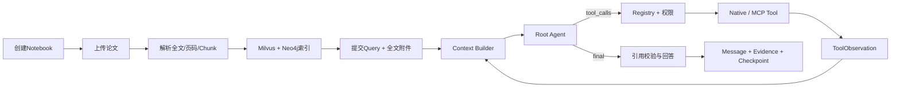
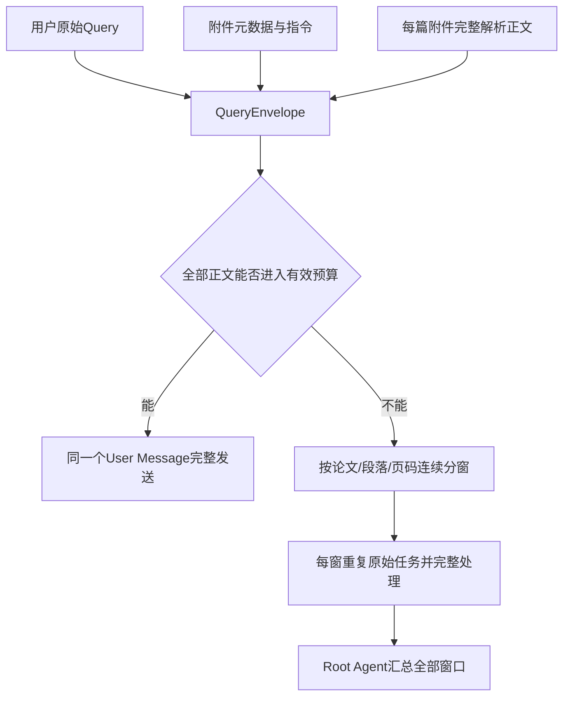
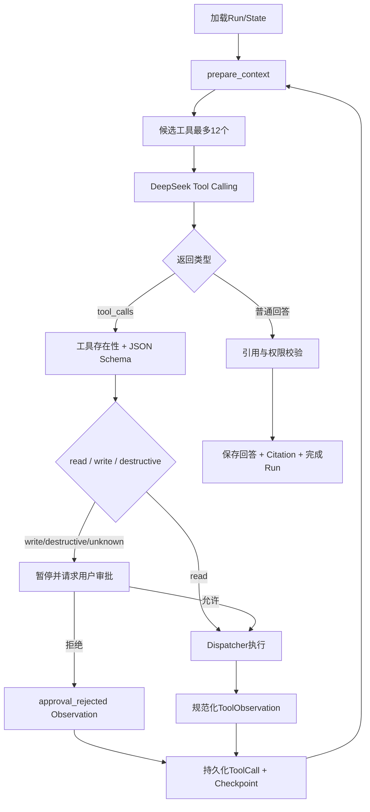
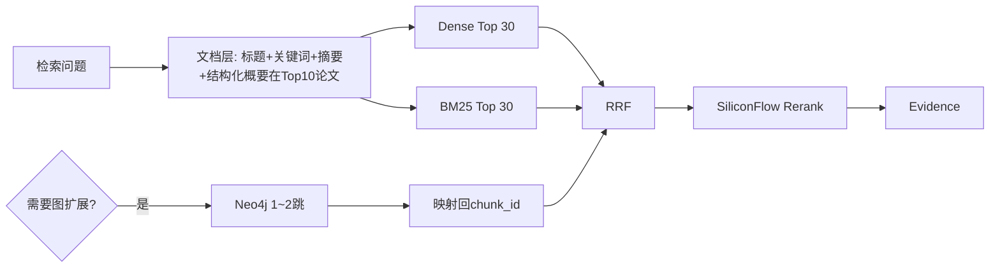
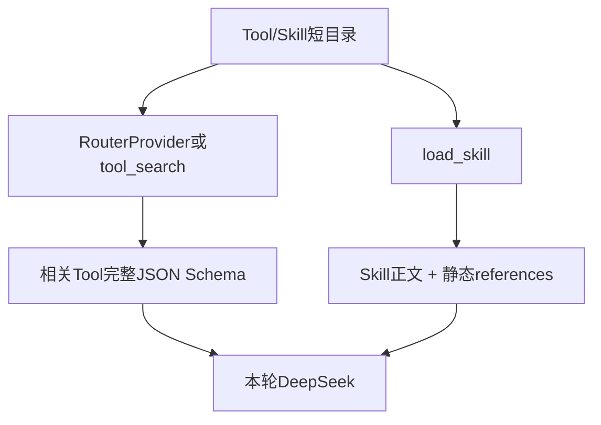

# NotebookAgent 核心闭环设计

> 最小心智模型：一个Root Agent反复执行“装上下文 → DeepSeek决定 → 校验工具 → 执行 → Observation回填”，直到给出有证据答案。

## 0. 一条完整闭环



第一版只有Root Agent。长期Memory、Subagent、MoA不是隐藏模块，也没有占位Runtime。

## 1. 当前Query：全文是主路径



`ContextManifest`记录：

```text
document_id / document_version_id / name
window_index / window_count
page_start / page_end
char_start / char_end
estimated_tokens / layers
```

完整分窗的验收不是“看起来都看了”，而是：首窗从字符0开始、末窗到正文结尾、相邻窗口连续，所有正文范围至少处理一次。

## 2. Agent Loop



终止条件：用户取消、10轮上限、运行超时、Provider重试耗尽、不可恢复错误。普通工具错误进入下一轮Observation，不直接冒充成功。

一次模型返回多个`tool_calls`时，Runtime先为全部调用建立记录，再逐个生成配对的`role=tool`结果；审批只暂停在当前调用，恢复后继续同一批次，超过单轮3个的调用也会收到明确的未执行Observation，不能留下协议悬空项。

## 3. 工具边界

```text
六个业务工具
├─ task_update               当前Run任务清单
├─ list_notebook_sources     当前Notebook资料
├─ search_notebook           Hybrid / GraphRAG统一入口
├─ get_notebook_items        精确读取有效Chunk
├─ search_papers             OpenAlex临时搜索
└─ get_paper_details         外部论文详情

Harness工具
├─ load_skill                渐进加载完整Skill
├─ tool_search               搜索短工具目录
└─ read_mcp_resource         读取MCP资源
```

Tool Search只缩小传给模型的Schema集合；DeepSeek仍决定最终动作。JEV以后替换`RouterProvider.select_tools()`，不能越过Registry、审批和Dispatcher。

## 4. 分层RAG与GraphRAG

`retrieval_mode`支持`hybrid / hybrid_graph / layered / auto / comprehensive`。`auto`在存在论文画像时走分层，否则回退flat hybrid。



论文画像由`document_profiles`保存（原始信息 + 结构化概要 + profile_text），向量写入`notebook_documents_v1`；Chunk向量在`document_chunks_v2`，带`section_id/ordinal`。文档层命中为空时返回`layered_degraded=true`并回退flat。图只扩展候选，不取代原文证据。Neo4j连接失败时必须返回：

```json
{
  "mode_requested": "hybrid_graph",
  "mode_used": "hybrid",
  "graph_degraded": true
}
```

## 5. MCP与Skills怎样进入上下文



- MCP连接由`config/mcp_servers.yaml`控制；stdio用于本地，Streamable HTTP用于远程。
- MCP工具统一命名空间，未知风险默认write。
- Skills由`config/skills.yaml`和目录控制，不从数据库编辑，也不执行脚本。
- Skill工具权限与用户权限取交集。
- NotebookAgent的`POST /mcp`只暴露配置白名单中的只读能力，并复查令牌、用户和Notebook。

## 6. 上下文分层与压缩

```text
System Prompt
当前完整Query或当前附件窗口
最近完整Turn
Conversation Summary
Agent State
Notebook Index
本轮Evidence
已加载Skill
本轮候选Tool/MCP Definitions
```

压缩采用Claude Code式两级策略，阈值相对有效输入预算（默认`CONTEXT_TRIM_THRESHOLD=0.6`、`CONTEXT_SUMMARY_THRESHOLD=0.75`）：


第一级无LLM；第二级把较旧Turn压成"目标/已完成/关键结论与[evidence]/待办/当前状态"摘要并写入`ConversationSummary`。保留最近`CONTEXT_KEEP_RECENT_TURNS`个Turn原文。

永不删除：当前Query、当前附件窗口、任务状态、有效Citation、安全规则、进行中的Tool Call。

`run_transcripts`保存与DeepSeek同构的每轮消息，`_history`按会话拼接最近`HISTORY_RECENT_RUNS`个Run的transcript后再交给压缩层。`ConversationSummary`会持久化并复用，但仅服务当前Conversation连续性；它不是跨会话长期Memory。每轮工具Observation回填后都会重新估算上下文，而不是只在Run开始时计算一次。

```text
Conversation Summary ≠ 长期Memory
Notebook Index ≠ 长期Memory
Checkpoint ≠ 长期Memory
RAG结果 ≠ 永久历史
```

## 7. 可恢复状态

MySQL保存`AgentRun / ToolCall / RunEvent / Checkpoint / ApprovalRequest`。SSE只是事件的实时视图，不是真相源。断线后客户端按事件序号续读；审批后Worker从保存的working messages和pending batch继续。

图索引与主任务解耦：文档在Milvus写入后立即`ready`，独立`build_graph_index`任务维护`DocumentVersion.graph_status`；图失败或未完成都不影响正文检索，前端据此显示图谱状态并提示。

## 8. 闭环验收

- Query附件在预算内时，完整正文能在一个User Message中被测试观察到。
- 超窗测试能够拼回原始全文，范围无空洞。
- 每个窗口携带原始任务和页码/字符范围。
- Agent每轮只收到候选工具Schema，不收到全部MCP Schema。
- 未知或写MCP工具一定暂停；拒绝后没有实际调用。
- GraphRAG结果回到有效MySQL Chunk；故障明确标记降级。
- 最终回答、事件、Manifest和Checkpoint可由Run ID查询。
- 断线后的SSE使用事件游标续读，刷新令牌后不会静默丢失Run事件。
- 多工具批次无未配对`tool_call`，连续审批可从Checkpoint恢复。
